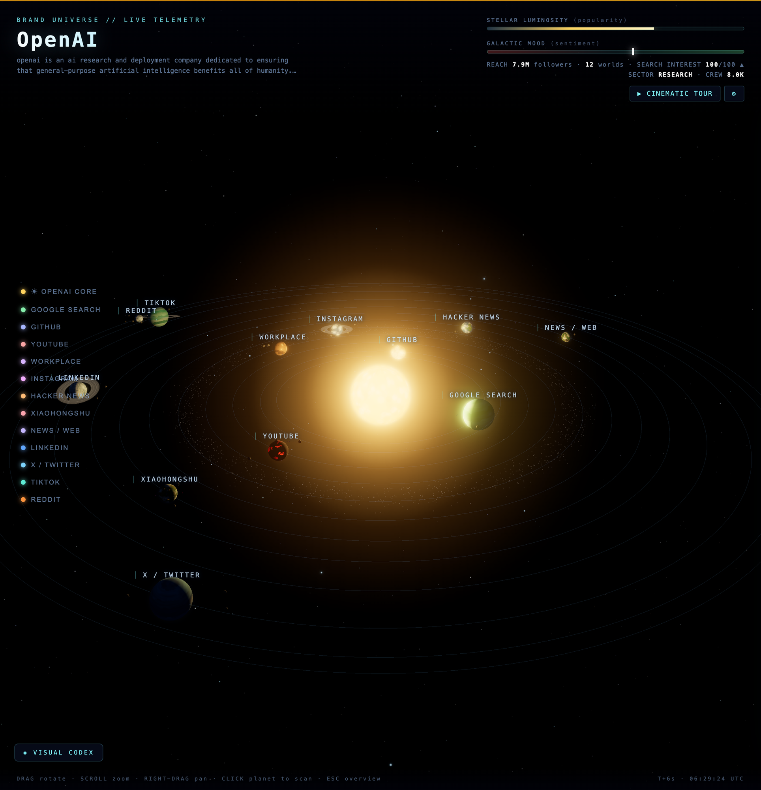

# Brand Solar System

An interactive, sci-fi 3D visualization of a company's brand presence across the internet — rendered as a living solar system.

The **sun** is the company (its size = popularity, its color = public sentiment). Every **planet** is a data source — X/Twitter, LinkedIn, TikTok, YouTube, GitHub, Reddit, Hacker News, Instagram, news coverage, Google Search, and more. Orbit distance, planet type, rings, moons, city lights, and ship traffic are all derived from real data pulled via [Monid](https://monid.ai). Click anything to scan it, or hit **▶ CINEMATIC TOUR** to fly through the whole system.



## Setup with an AI agent

Paste this into your coding agent (Claude Code, Cursor, Codex, etc.):

```text
Set up this project for me:

1. Follow the instructions at https://monid.ai/skill.md to install and set up
   the Monid CLI and the Monid skill (npm install -g @monid-ai/cli, monid setup,
   then add my API key via `monid keys add`). Ask me for my API key if I have
   one, or point me to https://app.monid.ai/access/api-keys to create it.
2. Read AGENT.md in this repo to understand the structure.
3. cp .env.example .env and fill it in — ask me which company/brand I want to
   visualize, and reuse the Monid API key from step 1.
4. npm install
5. npm run fetch        # pulls brand data (paid Monid API calls — confirm with
                        # me first and report the cost after)
6. npm start, then open http://localhost:4321 and verify the system renders.
```

## Setup by hand

**Prerequisites:** Node.js 18+, a [Monid](https://app.monid.ai) account and API key.

```bash
# 1. Install the Monid CLI and register your API key
npm install -g @monid-ai/cli
monid setup
monid keys add -k <your-api-key> -l main   # create one at https://app.monid.ai/access/api-keys

# 2. Configure the project
cp .env.example .env    # then edit: set COMPANY_NAME and MONID_API_KEY

# 3. Install and fetch brand data
npm install
npm run fetch           # ~18 Monid endpoints; costs a few dollars per run

# 4. Run
npm start               # http://localhost:4321
```

To stop the server: `kill $(lsof -ti :4321)`.

## Using it

| Action | How |
|---|---|
| Look around | drag to rotate · scroll to zoom · right-drag to pan |
| Scan a planet | click it (or use the legend, left side) — opens the planetary scan panel with metrics, keywords, and top posts |
| Scan the company core | click the sun — valuation, revenue, users, market position (PDL + Akta intel) |
| Back to overview | `Esc` or ✕ on the panel |
| Understand the visuals | **◈ VISUAL CODEX** button (bottom left) explains every visual mapping |
| Cinematic tour | **▶ CINEMATIC TOUR** (top right) — flies from deep space through the sun and every selected planet, then back out |
| Tour options | ⚙ next to the tour button: playback speed (0.5–2.5×) and which stops to visit |

The tour is designed to be easy to screen-record (e.g. macOS `⌘⇧5` or QuickTime) — steady flights, timed dwells on each scan panel, and a clean pull-back ending.

## What the visuals mean

Everything is data-driven — nothing is decorative:

- **Sun** — size/glow = brand popularity · color temperature = overall sentiment (red dwarf = hostile, white-hot = loved) · flare activity = rising search interest
- **Orbit distance** — discussion heat; the hottest platforms orbit closest
- **Planet size** — audience reach (biggest reach → gas giants)
- **Planet type** — ocean/terran = positive sentiment · lava/barren = negative · ice = calm outer worlds · desert = hot inner worlds
- **Rings** — top-3 platforms by keyword diversity
- **Moons** — the platform's top keywords (labels appear when focused)
- **City lights** (night side) — high engagement
- **Satellites** — high posting activity
- **Ship traffic** — inbound activity/engagement rate

## Refreshing data

```bash
npm run fetch                          # full live fetch (paid)
node scripts/fetch-data.mjs --cached   # rebuild data/company.json from data/raw/ (free)
```

Raw API responses are cached in `data/raw/`, so parser or scoring changes never require re-paying for data. To visualize a different company, change `COMPANY_NAME` in `.env` and run a fresh fetch.
